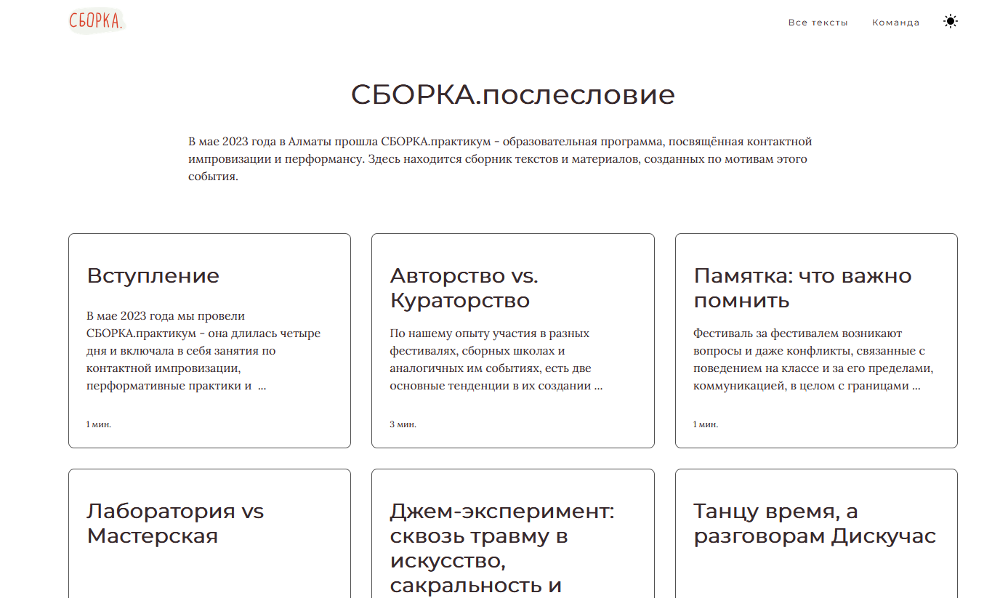

# Сайт с артефактами по СБОРКЕ - событию в области Контактной Импровизации (КИ)

Сайт сделан в виде серии блог-постов с форматированием, картинками, перекрестными ссылками.

[Демо](https://sborka.netlify.app)



## Особенности

* Авторские материалы
* Авторское оформление
* Работает на десктопе и мобильных приложениях
* Метаданные для SEO 
* Тэги по авторам
* Высокый показатель lighthouse
* Админка на Netlify CMS
* Легко задеплоить
* Управление через <https://app.netlify.com>

## Установка

```bash
# 0. Установка необходимых фрейморков
npm install

# 1. Скопировать репозитарий к себе локально
git clone https://github.com/ampil/sborka/

# 2. Перейти в каталог с репозитарием
cd sborka

# 3. Установка зависимостей для фрейморков
yarn install

# 4. Создать сборку / проверить билд
yarn  build

# 4. Запустить локальный сервер
yarn start


```


## Создание контента

### Посты в блоге

Страницы с постами находятся по пути `content/blog`. Есть заголовок, дата, описание, тэги (опционально). Редактируются через Markdown.

```md
---
title: Интро
date: '2023-09-01'
description: 'Этот текст будет показан в карточке блога'
---

Здесь можно ввести любой текст и отформатировать его средствами Markdown.
```

### Страницы

Домашняя страница, контакты, о команде расположены по пути `content/pages`. Редактируются через Markdown.

### Через админку Netlify CMS

По адресу <localhost:8000/admin> через веб-интерфейс можно создать посты или страницы для сайта.
Чтобы получить доступ в админку, смотрите пункт ниже.


# Обновление
Локальные изменения могут легко быть перенесены в интернет-версию сайта.
Для этого нужно соединить проект с Netlify CMS через Github.
Когда появляются новые коммиты на Github, Netlify самостоятельно заберёт их и пересоздаст сборку сайта, которую затем выпустит в веб.

Для этого - авторизуйтесь через Netlify Identity:

- Залогиньтесь в <https://app.netlify.com>, выберите свой сайт.
- В пункте Identity кликнуть на Enable Identity.
- Для админки, кликните на Invite Users и введите свой емейл.
- Теперь в Settings > Identity > Services нажать Enable Git Gateway.
- Если сайт нишевый - лучше ограничить регистрацию. Для этого зайдите в Settings > Identity > Registration > Registration Preferences. Выставить там Invite Only (в бесплатной версии до 3 аккаунтов).
- Теперь можно зайти на ваш веб-сайт <sborka.netlify.app/admin/>, и залогниться.

Теперь можно создавать посты и страницы через админку Netlify CMS. 

## Технологии

- движок Gatsby для быстрой генерации страниц
- Netlify CMS для управления контентом
- основано на https://gatsbyglass.netlify.app
